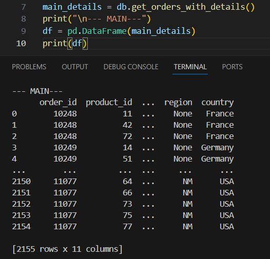
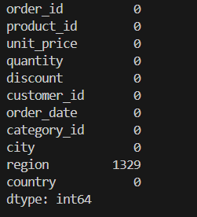
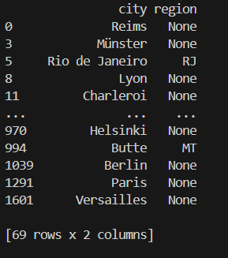
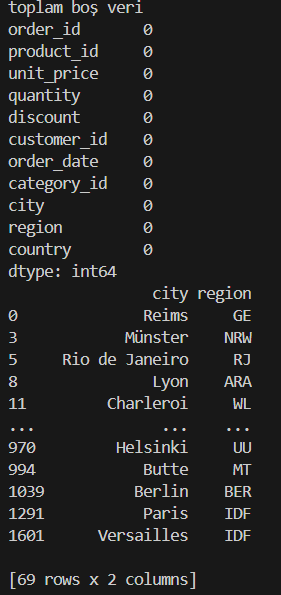
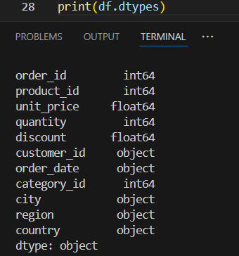
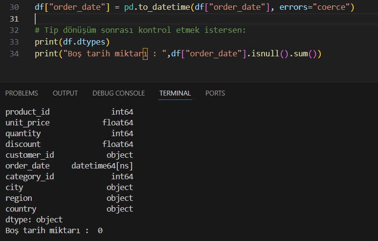
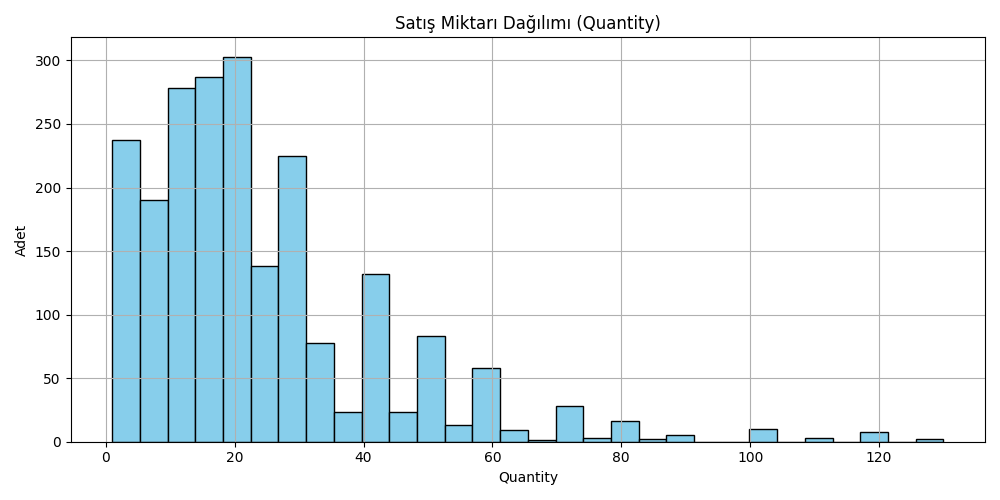
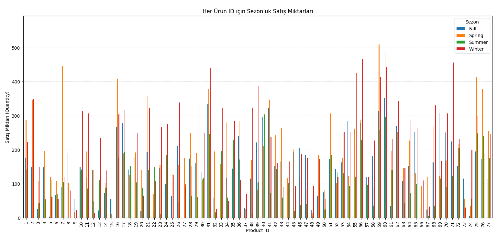
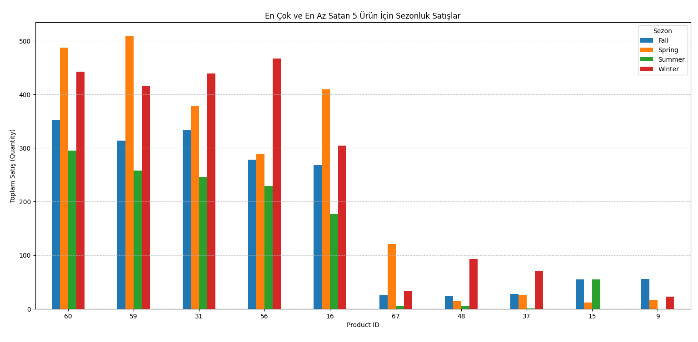

# Sales Prediction with Northwind Dataset

This project includes machine learning models developed using the Northwind database. At the end of the project, the performance of different models is compared to choose the most accurate one for the target problem.

---

## Branch Overview

- `main`: Contains the initial, flat version of the project with minimal structure.
- `master`: Contains the improved, modular version with organized folders and refactored codebase.

---

## Technologies Used
- Python 3.12
- pandas
- numpy
- matplotlib
- scikit-learn
- FastAPI
- joblib

---

## Data Processing Steps

1. Data was retrieved from the PostgreSQL Northwind database.
2. Raw tables like `orders` and `order_details` were merged to form a master table.



Null values were identified and visualized:




Missing regions were filled with realistic values using the `regions.py` script.



Data types were checked and converted as necessary:




---

## Problem 1: Predict Sales Quantity

Given the unit price, discount, season, and product ID, the model predicts the expected quantity sold.

**Features used:**
- `product_id`: ID of the product
- `unit_price`: Price per unit
- `discount`: Discount rate applied
- `season`: Season code (1: Winter, 2: Spring, 3: Summer, 4: Autumn)

---

## Modeling Process

1. Features and target were selected.
2. The target variable was the **quantity sold**.
3. Data was split into training and testing sets.
4. Multiple models were trained:
   - Linear Regression
   - Logistic Regression
   - KNN
   - Decision Tree
   - Random Forest

Visualizations showed imbalance in the dataset:

  
  


---

## Accuracy & Best Model

Model performance was evaluated using accuracy and other metrics.  
**Best performing model:** See model scripts for inline comments on accuracy scores.

---

## FastAPI (API.py)

This project includes a FastAPI-based REST API that uses a pre-trained model to predict sales quantity based on user input.

### Features:
- **Simple & Extendable**: FastAPI makes it easy to add new endpoints.
- **Model Integration**: Loads pre-trained model via `joblib`.
- **Error Handling**: Custom global exception handlers for user-friendly messages.

---

## Running the API

### Step 1 – Install Requirements:
```bash
pip install -r requirements.txt
```

### Step 2 – Start the API:
```bash
uvicorn API:app --reload
```

### Step 3 – Test in Browser:
Go to: [http://127.0.0.1:8000/docs](http://127.0.0.1:8000/docs)  
Try the endpoints interactively in Swagger UI.

---

## API Endpoints

### `GET /`
Returns a welcome message:
```json
{"message": "Welcome to the Sales Prediction API."}
```

### `POST /predict`
Send JSON like:
```json
{
  "product_id": 10,
  "unit_price": 25.0,
  "discount": 0.1,
  "season": 3
}
```
Response:
```json
{
  "prediction": 20.35,
  "details": {
    "product_id": 10,
    "unit_price": 25.0,
    "discount": 0.1,
    "season": 3
  }
}
```

### Input Validation Rules:
- `product_id`: integer (1 to 77)
- `unit_price`: float
- `discount`: float (e.g., 0.1 = 10%)
- `season`: integer (1=Winter, 2=Spring, 3=Summer, 4=Autumn)

---

## Error Handling
Custom exception handlers:
1. `ValueError`: e.g., wrong season or product ID → 400
2. `RequestValidationError`: invalid input → 422
3. `Exception`: unexpected issues → 500

These help make the API more reliable and user-friendly.

---

## Example Usage

### `GET /`
Visit [http://127.0.0.1:8000/docs](http://127.0.0.1:8000/docs) → Click "Try it out" on GET `/`

### `POST /predict`
Use Swagger UI or Postman to send prediction input.

Try inputs and review outputs, including:
- Prediction result
- Input details
- Error message (if input is invalid)

---

If you have questions, feel free to reach out!
